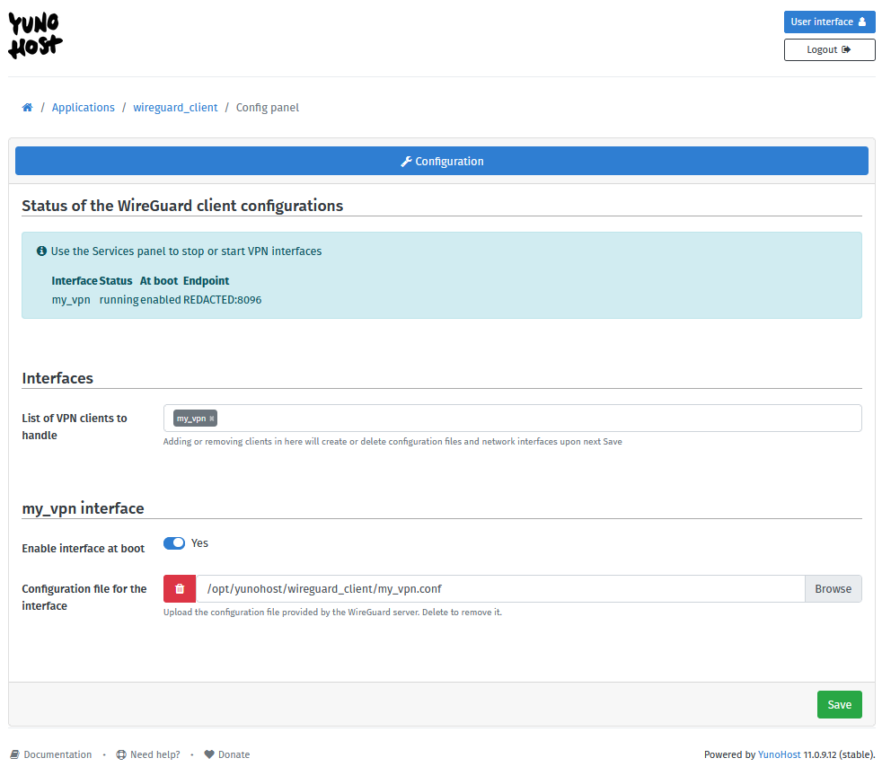

<!--
Важно: этот README был автоматически сгенерирован <https://github.com/YunoHost/apps/tree/master/tools/readme_generator>
Он НЕ ДОЛЖЕН редактироваться вручную.
-->

# WireGuard Client для YunoHost

[](https://ci-apps.yunohost.org/ci/apps/wireguard_client/)


[](https://install-app.yunohost.org/?app=wireguard_client)

*[Прочтите этот README на других языках.](./ALL_README.md)*

> *Этот пакет позволяет Вам установить WireGuard Client быстро и просто на YunoHost-сервер.*  
> *Если у Вас нет YunoHost, пожалуйста, посмотрите [инструкцию](https://yunohost.org/install), чтобы узнать, как установить его.*

## Обзор

WireGuard® is fast and modern VPN that utilizes state-of-the-art cryptography.  
It aims to be faster, simpler, leaner, and more useful than IPsec. It intends to be considerably more performant than OpenVPN. WireGuard is designed as a general purpose VPN.

This package only ships a YunoHost configuration panel to load WireGuard configuration files and create the VPNs.


**Поставляемая версия:** 0.3~ynh4

## Снимки экрана



## Документация и ресурсы

- Официальный веб-сайт приложения: <https://www.wireguard.com/>
- Магазин YunoHost: <https://apps.yunohost.org/app/wireguard_client>
- Сообщите об ошибке: <https://github.com/YunoHost-Apps/wireguard_client_ynh/issues>

## Информация для разработчиков

Пришлите Ваш запрос на слияние в [ветку `testing`](https://github.com/YunoHost-Apps/wireguard_client_ynh/tree/testing).

Чтобы попробовать ветку `testing`, пожалуйста, сделайте что-то вроде этого:

```bash
sudo yunohost app install https://github.com/YunoHost-Apps/wireguard_client_ynh/tree/testing --debug
или
sudo yunohost app upgrade wireguard_client -u https://github.com/YunoHost-Apps/wireguard_client_ynh/tree/testing --debug
```

**Больше информации о пакетировании приложений:** <https://yunohost.org/packaging_apps>
